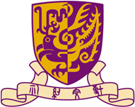

<div align="left">
  
  
</div>

# RTL-CLAW: An AI-Agent-Driven Framework for Automated IC Design Flow

> A collaborative project between **Tongji EDA Lab** and **The Chinese University of Hong Kong (CUHK)**  
> **Project Leader:** Yuyang Ye

RTL-CLAW is a research-oriented EDA toolchain built on top of the OpenClaw framework. It is designed to showcase an AI-agent-driven workflow for automated IC design, while also serving as a platform for integrating our research outcomes, open-source tools, and commercial EDA tools into the toolchain through extensible plugins.

This project will be continuously updated to support the integration of more research outcomes, open-source tools, and commercial EDA tools.

If you have any questions, suggestions, or feature requests, please feel free to submit an issue. Your feedback will help us improve the project.

---

## Authors

Haotian Yu<sup>1,2</sup>, Yuchen Liu<sup>1</sup>, Qibo Xue<sup>3,4</sup>, Yuan Pu<sup>3,4</sup>, Yuntao Lu<sup>3</sup>, Xufeng Yao<sup>3</sup>, Zhuolun He<sup>3,4</sup>, Yuyang Ye<sup>1,3</sup>, Lei Qiu<sup>1</sup>, Qing He<sup>1,2</sup>, Bei Yu<sup>3</sup>

## Affiliations

<sup>1</sup> Tongji University, Shanghai, China  
<sup>2</sup> Phlexing Technology Co. Ltd., Hangzhou, China  
<sup>3</sup> The Chinese University of Hong Kong, Hong Kong, China  
<sup>4</sup> Chateda

---

## Overview

RTL-CLAW is primarily intended to demonstrate an AI-agent-driven IC design flow based on the OpenClaw framework. In addition to the OpenClaw-based infrastructure, this project also serves as a unified platform for showcasing our research work and gradually integrating additional capabilities through plugins.

The long-term goal of RTL-CLAW is to provide an extensible toolchain that supports:

- integration of research prototypes,
- integration of open-source EDA tools,
- integration of commercial EDA tools, and
- rapid experimentation with AI-agent-driven design automation workflows.

> **Note:** Some features are not yet publicly available because the related research has not been published yet.

---

## Prerequisites

1. This image is built locally based on the official OpenClaw image. Please follow the official OpenClaw repository to build `openclaw:local` locally first.

2. Build the RTL-CLAW Docker image with:

```bash
docker build -t rtl-claw:latest-dev .
```

---

## Initialize a Minimal Configuration

Run the following command to initialize the environment and generate a minimal configuration:

```bash
docker compose run --rm rtl-claw-cli onboard \
    --reset \
    --non-interactive \
    --accept-risk \
    --flow Manual \
    --gateway-bind lan \
    --skip-channels \
    --skip-daemon \
    --skip-search \
    --skip-skills
```

---

## Start the Container Services

Create the required local directories and start the gateway service:

```bash
mkdir .openclaw/ && mkdir workspace
docker compose up -d rtl-claw-gateway
```

---


## Demo Flow
We will show your a easy demo flow, traffic light.

1. Open your conversation web page at `http://localhost:18789`, locate the generated token in `./openclaw/openclaw.json`, and enter it on the conversation page to complete authentication. If you encounter an issue requiring device approval, execute:  
   ```bash
   docker compose run --rm rtl-claw-cli devices list
   docker compose run --rm rtl-claw-cli devices approve <Request ID>
   ```

2. **Verilog Partition Functionality**:  
   Place your Verilog design files under the `workspace` directory (it is recommended to create a new folder within it). In the conversation dialog, enter:  
   ```
   Use the verilog-partition module to split /path/to/your/file/traffic.v, and output the results to /path/to/your/output
   ```
3. Additional Functional Commands:
    For other features such as Verilog optimization, testbench generation, and Yosys, simply follow the example in step 2. Further guidance is comming soon.


## Project Status

RTL-CLAW is currently under active development.

We will continue to expand this toolchain by integrating more research outcomes, additional open-source EDA utilities, selected commercial EDA tool interfaces, and new agent-based workflow plugins.

As the project evolves, the repository structure, supported features, and plugin interfaces may continue to change.

---

## Notes

- This project is intended for research demonstration and framework prototyping.
- Some modules or plugins may remain unavailable in the public version until the related work is published.
- The current workflow assumes a local Docker-based environment.

---

## Contributing

Contributions, suggestions, and issue reports are welcome.

If you encounter any problems or would like to suggest improvements, please open an issue in this repository.

---

## Acknowledgements

RTL-CLAW is developed as a collaborative effort between **Tongji EDA Lab** and **The Chinese University of Hong Kong (CUHK)**, with the goal of advancing AI-agent-driven IC design automation research and practice.

---

## Citation

If you find this project useful in your research or development, please consider citing the relevant papers or referencing this repository once the associated publications are available.

---

## License

License information will be added later.
