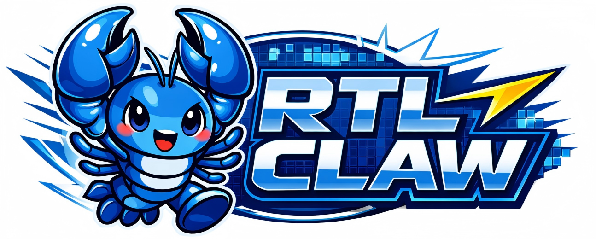

<div>
  <picture>
    <source media="(prefers-color-scheme: dark)" srcset="./tongji_logo_dark.png">
    
  </picture>

  <picture>
    <source media="(prefers-color-scheme: dark)" srcset="./cu_logo_dark.png">
    
  </picture>

  <picture>
    <source media="(prefers-color-scheme: dark)" srcset="./RTLCLAW_logo_dark.png">
    
  </picture>
</div>

# RTL-CLAW: An AI-Agent-Driven Framework for Automated IC Design Flow

> A collaborative project between **Tongji EDA Lab** and **The Chinese University of Hong Kong (CUHK)**  
> **Project Leader:** Yuyang Ye (ead_tongji@126.com)

RTL-CLAW is an open-source, research-oriented EDA toolchain built on top of the OpenClaw framework. It aims to demonstrate an AI-agent-driven workflow for automated IC design, while providing an extensible platform for integrating research outcomes, open-source tools, and commercial EDA tools through modular plugins.

For more technical details, please refer to the accompanying [RTL-CLAW Technical Report](./RTL-CLAW.pdf).

---

## 👥 Authors

Haotian Yu<sup>1,2</sup>, Yuchen Liu<sup>1</sup>, Yifan Wang<sup>1</sup>, Qibo Xue<sup>3,4</sup>, Yuan Pu<sup>3,4</sup>, Shuo Yin<sup>3</sup>, Yuntao Lu<sup>3</sup>, Xufeng Yao<sup>3</sup>, Zhuolun He<sup>3,4</sup>, Yuyang Ye<sup>1,3</sup>, Lei Qiu<sup>1</sup>, Qing He<sup>1,2</sup>, Bei Yu<sup>3</sup>

## 🏫 Affiliations

<sup>1</sup> Tongji University, Shanghai, China  
<sup>2</sup> Phlexing Technology Co. Ltd., Hangzhou, China  
<sup>3</sup> The Chinese University of Hong Kong, Hong Kong, China  
<sup>4</sup> Chateda

---

## 📌 Overview

RTL-CLAW is primarily intended to demonstrate an AI-agent-driven IC design flow based on the OpenClaw framework. It also serves as a unified platform for showcasing our research work and gradually integrating additional capabilities through plugins.

The long-term goal of RTL-CLAW is to provide an extensible toolchain that supports RTL design automation, verification, synthesis, and future cross-stage integration with physical design workflows.

> **Note:** Some features are not yet publicly available because the related research has not been published yet. More implementation details can be found in the accompanying [RTL-CLAW Technical Report](./RTL-CLAW.pdf).

---

## ✨ Features

- AI-agent-driven workflow
- RTL analysis and partition
- Partition-Opt-Merge optimization
- Verification and testbench generation
- Open-source EDA integration

For more technical details, please refer to the accompanying [RTL-CLAW Technical Report](./RTL-CLAW.pdf).

---

## 🏗️ Architecture Summary

RTL-CLAW follows a layered design with three main components:

1. **Interaction Layer** for user instructions and workflow control
2. **Agent Core Layer** for task planning and execution
3. **Tool and Data Flow Layer** for connecting RTL analysis, verification, optimization, and synthesis tools

More implementation details are provided in the accompanying [RTL-CLAW Technical Report](./RTL-CLAW.pdf).

---

## 🔬 Current Technical Scope

The current RTL-CLAW framework focuses on AI-agent-driven automation for front-end IC design tasks, including RTL analysis, verification environment generation, RTL partition and optimization, and logic synthesis.

At the current stage, the flow mainly targets the **ASAP7nm** technology library for research and evaluation. As described in the project roadmap, we also plan to extend RTL-CLAW toward broader back-end and cross-stage design automation.

---

## 🛣️ Roadmap

RTL-CLAW will continue to evolve beyond the current front-end flow. Planned directions include:

- integration of an open-source back-end implementation flow based on **DreamPlace + OpenROAD**
- support for a broader set of open-source EDA tools, together with selective compatibility with commercial EDA tools
- future extension toward **3D IC-oriented design flows**

These directions are part of our ongoing research and engineering efforts, and some of them are still under active development.

---

## ⚙️ Prerequisites

1. This image is built locally based on the official OpenClaw image. Please follow the official OpenClaw repository to build `openclaw:local` locally first.
2. Build the RTL-CLAW Docker image with:

```bash
docker build -t rtl-claw:latest-dev .

---

## 🚀 Quick Start

### Initialize a Minimal Configuration

Run the following command to initialize the environment and generate a minimal configuration:

```bash
docker compose run --rm rtl-claw-cli onboard \
    --reset \
    --non-interactive \
    --accept-risk \
    --flow Manual \
    --gateway-bind lan \
    --skip-channels \
    --skip-daemon \
    --skip-search \
    --skip-skills

###Start the Container Services
Create the required local directories and start the gateway service:

```bash
mkdir .openclaw/ && mkdir workspace
docker compose up -d rtl-claw-gateway
```
---

## 🧪 Demo

We provide a simple demo flow based on a traffic light controller.

1. Open your conversation web page at `http://localhost:18789`, locate the generated token in `./openclaw/openclaw.json`, and enter it on the conversation page to complete authentication. If you encounter an issue requiring device approval, execute:  
   ```bash
   docker compose run --rm rtl-claw-cli devices list
   docker compose run --rm rtl-claw-cli devices approve <Request ID>
   ```

2. **Verilog Partition Functionality**:  
   Place your Verilog design files under the `workspace` directory (it is recommended to create a new folder within it). In the conversation dialog, enter:  
   ```
   Use the verilog-partition module to split /path/to/your/file/traffic.v, and output the results to /path/to/your/output
   ```
3. Additional Functional Commands:
    For other features such as Verilog optimization, testbench generation, and Yosys, simply follow the example in step 2. Further guidance is coming soon.

For more details about the demo workflow and generated outputs, please refer to the accompanying  [RTL-CLAW Technical Report](./RTL-CLAW.pdf).

---

## 📂 Project Structure

The repository is intended to evolve into a modular framework that includes:

- Agent workflow components,
- RTL analysis and transformation modules,
- Verification-related utilities,
- Synthesis tool integrations, and
- Extensible plugin interfaces.

The exact structure may continue to change as the project develops.

---

## 📝 Notes
- This project is intended for research demonstration and framework prototyping.
- Some modules or plugins may remain unavailable in the public version until the related work is published.
- The current workflow assumes a local Docker-based environment.
- Some technical details, workflow descriptions, and case-study results are documented in the accompanying [RTL-CLAW Technical Report](./RTL-CLAW.pdf).

---

## 🤝 Contributing

Contributions, suggestions, and issue reports are welcome.

If you encounter any problems or would like to suggest improvements, please open an issue in this repository.

---

## 🙏 Acknowledgements

RTL-CLAW is developed as a collaborative effort between Tongji EDA Lab and The Chinese University of Hong Kong (CUHK), with the goal of advancing AI-agent-driven IC design automation research and practice.

The project is led by Yuyang Ye. We sincerely thank all collaborators and contributors for their valuable efforts in system design, implementation, experimentation, validation, and documentation. The progress of RTL-CLAW would not have been possible without the collective dedication and collaboration of the team.

---

## 📄 Technical Report

A more detailed description of the project background, architecture, methodology, workflow, and demo results is provided in the accompanying [RTL-CLAW Technical Report](./RTL-CLAW.pdf).

---

## 📚 Citation

If you find this project useful in your research or development, please consider citing the relevant papers or referencing this repository once the associated publications are available.

---

## 📜 License

License information will be added later.


